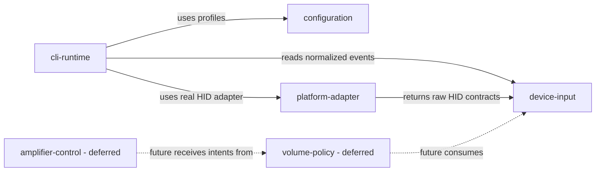

# Domain Map

## Dependency Rules

| From | May depend on | Must not depend on |
|---|---|---|
| device-input | Python standard library | platform-adapter, cli-runtime, HIDAPI |
| configuration | device-input contracts | cli-runtime, platform-adapter |
| platform-adapter | device-input contracts, HIDAPI | cli-runtime, configuration |
| cli-runtime | device-input, configuration, platform-adapter | future volume/amplifier implementation |
| volume-policy | device-input contracts in a later phase | HIDAPI, cli-runtime |
| amplifier-control | future volume-policy contracts | HIDAPI input adapter |

## Health Summary

| Check | Command | Status |
|---|---|---|
| Import boundaries | `python scripts/check_boundaries.py` | Active |
| Deterministic replay | `python -m exotic_knob.cli.main replay --fixture tests/fixtures/anticater/sample_reports.jsonl` | Active |

