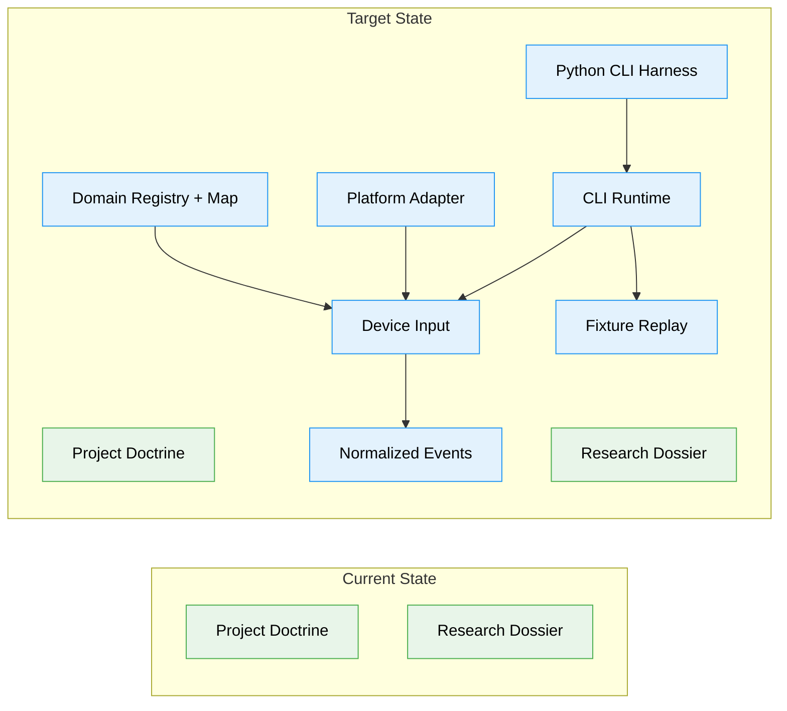

# Flight Plan: Anticater VK-01 Bluetooth Input Baseline

**Spec**: [bluetooth-input-baseline-spec.md](./bluetooth-input-baseline-spec.md)  
**Plan**: [bluetooth-input-baseline-plan.md](./bluetooth-input-baseline-plan.md)  
**Generated**: 2026-06-05  
**Status**: Complete — software baseline landed; hardware smoke pending

---

## The Mission

**What we're building**: A Python/HIDAPI CLI that identifies an Anticater VK-01
volume knob, opens its HID interface, prints raw reports, emits best-effort
normalized events, and saves JSONL fixtures for replay.

**Why it matters**: This gives us real device evidence and deterministic replay
before building daemon behavior, ESP32 paths, or NAD M33 BluOS dB volume control.

---

## Where We Are → Where We're Headed

```text
TODAY:                                      AFTER this plan:
Doctrine and research only                  Runnable Anticater capture CLI

🔵 Project rules exist                       🔵 Project rules remain authoritative
❌ No Python project substrate               🔴 Minimal Python CLI substrate
❌ No engineering harness                    🔴 Boot/test/lint/smoke commands
❌ No domain registry/map                    🔴 Six documented domain boundaries
❌ No HID device capture                     🔴 HID enumeration and raw capture
❌ No replayable fixtures                    🔴 JSONL capture/replay fixtures
❌ No normalized knob events                 🔴 Best-effort normalized events
❌ No hardware smoke evidence                🔴 Anticater operation capture notes
```



**Legend**: existing (green) | changed (orange) | new (blue)

---

## Scope

**Goals**:

- Pair/connect the Anticater VK-01 through the operating system and select the
  matching HID interface from the CLI.
- Capture HID descriptors and identifying metadata for USB, Bluetooth, and 2.4
  GHz modes where available.
- Print raw HID reports for rotate, click, and long-press+rotate operations.
- Emit best-effort normalized events from observed reports.
- Save JSONL fixtures suitable for deterministic replay tests.
- Establish a Python/HIDAPI baseline that can run on macOS first and remain
  portable to PC platforms.
- Keep event contracts transport-neutral for future ESP32 and BluOS dB policy.

**Non-Goals**:

- No NAD M33/BluOS control in this baseline.
- No daemon installation or background service behavior.
- No live LED/RGB control unless a vendor-defined control channel is discovered.
- No reverse engineering of Anticater vendor software in this phase.
- No custom Bluetooth pairing workflow.

---

## Journey Map


**Legend**: green = done | yellow = active | grey = not started

---

## Phases Overview

| Phase | Title | Tasks | CS | Status |
|---|---|---:|---|---|
| 1 | Simple Implementation | 12 | CS-3 | Landed; real-device smoke pending |

---

## Acceptance Criteria

- [x] CLI lists candidate HID interfaces for the Anticater VK-01.
- [x] CLI opens a selected interface and prints timestamped raw reports.
- [ ] Real-device smoke captures evidence for rotate left/right, click/mute, and
      long-press+rotate actions.
- [x] CLI saves JSONL fixtures that can be replayed without hardware.
- [x] Replayed fixtures emit the same best-effort normalized events.
- [x] Obvious consumer-control reports map to volume, mute, brightness, or
      unknown events.
- [x] Vendor-defined reports are reported as capabilities, not used for LED/RGB
      control in the baseline.
- [x] README and `docs/how/` explain pairing, capture, replay, fixture format,
      and LED/RGB limitations.

---

## Key Risks

| Risk | Mitigation |
|---|---|
| OS filters or consumes HID reports | Include hardware smoke capture and clear diagnostics for failed open/read |
| HID reports differ across USB/Bluetooth/2.4 GHz | Capture mode-specific descriptors and report fixtures |
| LED/RGB control is not publicly exposed | Defer control unless output/feature reports are discovered |
| Parser overfits one report shape | Preserve raw fixtures and use `unknown` for unmapped reports |
| Future ESP32 path is constrained by desktop choices | Keep normalized event contracts transport-neutral |
| Captures leak local device identifiers | Document redactable fixture fields before sharing |

---

## Flight Log

| Time | Entry |
|---|---|
| 2026-06-05T03:33:51Z | Simple Implementation landed: Python CLI substrate, domain docs, fakes-only HID tests, JSONL fixture schema, shared capture/replay normalization, HIDAPI adapter boundary, docs, and harness commands. Real Anticater smoke evidence remains pending physical device capture. |
| 2026-06-05T03:45:13Z | Review approved with notes and merge analysis found no upstream divergence; no merge execution required. |
| 2026-06-05T03:49:40Z | HIDAPI setup/listing was promoted into the engineering harness; `just list-devices` found Anticater candidates. |
