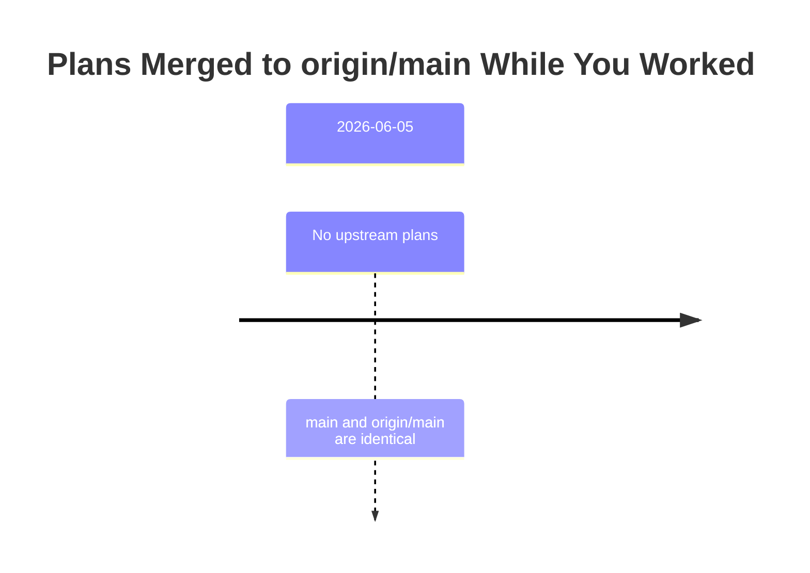
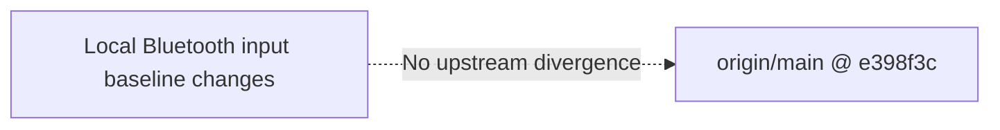

# Merge Plan: Integrating Upstream Changes

**Generated**: 2026-06-05T03:45:13Z  
**Your Branch**: `main` @ `e398f3c177a80028bc8e525605a00623eaca6acf`  
**Merging From**: `origin/main` @ `e398f3c177a80028bc8e525605a00623eaca6acf`  
**Common Ancestor**: `e398f3c177a80028bc8e525605a00623eaca6acf`

---

## Executive Summary

### What Happened While You Worked

No upstream plans or commits landed in `origin/main` since the current branch
point. `main`, `origin/main`, and the common ancestor are the same commit.

| Plan | Merged | Purpose | Risk to You | Domains Affected |
|------|--------|---------|-------------|------------------|
| None | N/A | No upstream work to merge | None | None |

### Conflict Summary

- **Direct Conflicts**: 0 files
- **Semantic Conflicts**: 0
- **Regression Risks**: 0 from upstream merge

### Recommended Approach

```text
No upstream merge is needed. Commit and push the completed local baseline work
when ready; keep real Anticater hardware smoke evidence as a documented follow-up.
```

## Timeline



## Conflict Map



## Upstream Plans Analysis

No upstream plans were discovered.

## Conflict Analysis

No direct or semantic conflicts exist because there are no upstream changes to
merge.

## Regression Risk Analysis

| Risk | Direction | Upstream Plan | Your Change | Likelihood | Test Command |
|------|-----------|---------------|-------------|------------|--------------|
| None from upstream merge | N/A | None | Bluetooth input baseline | Low | `python3 -m pytest` |

## Merge Execution Plan

No merge execution is required.

If committing the completed local work, use the normal project validation first:

```bash
python3 -m pytest
python3 -m ruff check .
python3 scripts/check_boundaries.py
just smoke
git diff --check
```

## Human Approval Required

There is no upstream merge to execute. No `PROCEED` action is required for merge.

Committing or pushing the completed local implementation is a separate source
control action and should only happen when explicitly requested.

## Post-Merge Validation

- [x] No upstream merge required.
- [x] Branch and target point to the same commit.
- [x] Review approved with notes.
- [x] Real Anticater hardware smoke evidence remains documented as pending.

