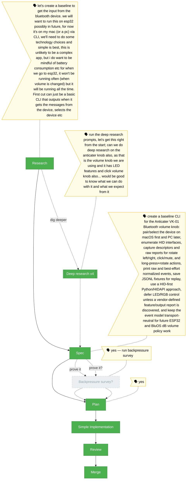

# Flight plan — bluetooth-input-baseline

**Plan**: bluetooth-input-baseline · **Mode**: Simple · **Phases**: 1
**Rail**: `[the-flow] ◆─◆─◆─◆─◆` · **now**: Flow complete · **next**: Commit/push when explicitly requested; real hardware smoke remains follow-up

**Legend**: 🟩 done · 🟧 in progress · 🟥 blocked · 🟦 known future (designed) · ⬜╴assumed future (dashed) · 🟨 🗣 verbatim user input · companion (teal, wraps) · worker (indigo, side)

_Generated from `the-flow.json`. Do not hand-edit this file as the primary; update `the-flow.json` first and regenerate._
